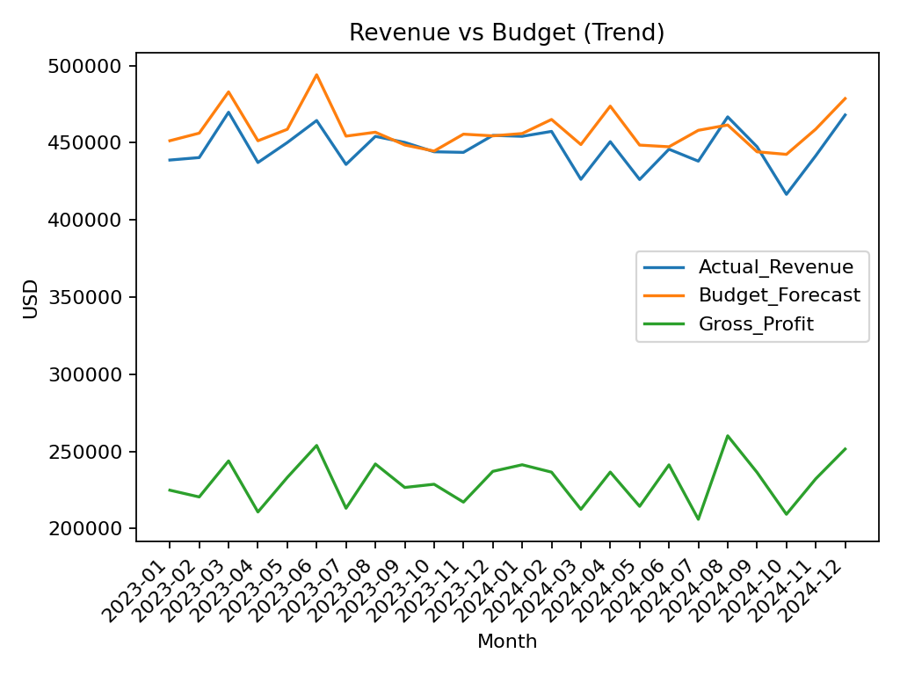
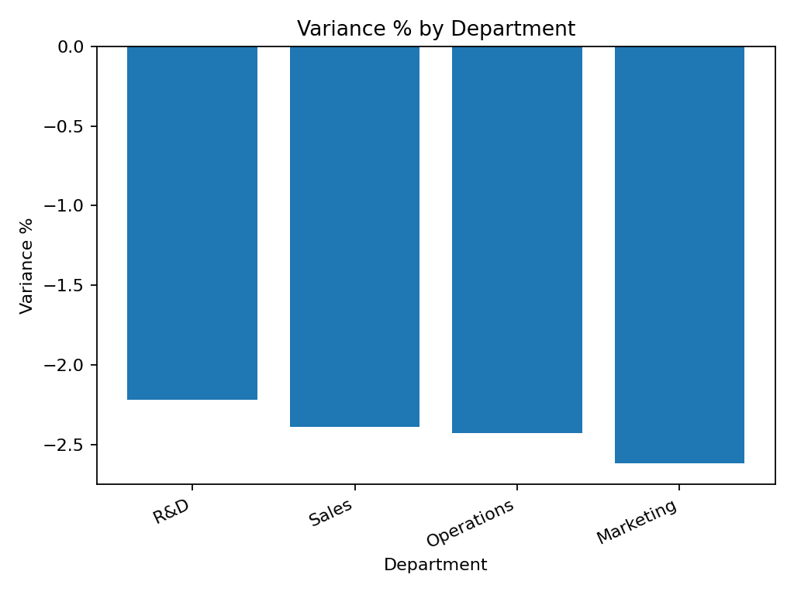

# 📊 FP&A AI Dashboard

An **AI-powered Financial Planning & Analysis (FP&A) project** showcasing variance analysis, forecasting, and automated executive summaries.  
Built with **Python (pandas, statsmodels, OpenAI/Azure OpenAI)** and visualized in **Power BI**.

---

## 🚀 Features

- **Variance Analysis**  
  - SQL/Pandas pipeline calculates Actual vs. Budget, Variance %, and Gross Margin.  
  - Department-level and monthly trend views.  

- **Forecasting**  
  - Department-level forecasting using statistical models.  
  - Produces a 3–6 month forward outlook with upper/lower confidence bounds.  

- **AI Executive Summary**  
  - Auto-generates 4–6 sentence FP&A-style narratives.  
  - Runs locally with fallback (rule-based summary).  
  - If keys are provided, integrates with **Azure OpenAI** or **OpenAI API** for polished language.  

- **Interactive BI**  
  - Data outputs (`.csv`) imported into **Power BI/Tableau** for dashboards.  
  - Supports variance heatmaps, monthly trend lines, and department forecasting visuals.

---

## 📂 Project Structure

```text
fpna-ai-dashboard/
├── data/
│ ├── financials.csv # Raw dataset (input)
│ ├── variance_summary.csv # Dept rollup
│ ├── monthly_trend.csv # Revenue/profit trend
│ ├── department_variance.csv # Dept-level variance table
│ ├── latest_kpis.csv # Most recent KPIs
│ ├── forecast_by_department.csv # Forecasted revenues by dept
│ ├── exec_summary.md # AI-generated executive summary
│ ├── viz_trend.png # Trend chart
│ ├── viz_dept_variance.png # Dept variance chart
│ ├── viz_forecast_dept.png # Forecast chart
│ └── fpna_onepager.pptx # Auto-generated one-pager deck
│
├── python/
│ ├── generate_data.py # Creates synthetic financial dataset
│ ├── variance_analysis.py # Variance + KPI pipeline
│ ├── forecast.py # Forecasting by department
│ ├── ai_summary.py # AI/LLM executive summary
│ ├── make_visuals.py # Generates charts as PNGs
│ └── make_deck.py # Builds PowerPoint one-pager
│
├── sql/
│ └── variance_analysis.sql # SQL version of variance rollup
│
├── .env # API keys (excluded via .gitignore)
├── .gitignore # Ignore venv, env, cache files
└── README.md
```

## ⚙️ Setup

```bash
# Clone repo
git clone https://github.com/willckim/fpna-ai-dashboard.git
cd fpna-ai-dashboard

# Create venv
python -m venv .venv
.venv\Scripts\activate   # (Windows)

# Install dependencies
pip install -r requirements.txt
```

## 🔑 Environment Variables
Create a .env file in the project root:

```bash
env
# OpenAI
OPENAI_API_KEY=sk-...

# OR Azure OpenAI
AZURE_OPENAI_KEY=...
AZURE_OPENAI_ENDPOINT=https://<your-endpoint>.openai.azure.com/
AZURE_OPENAI_DEPLOYMENT=gpt-4o-mini
AZURE_OPENAI_API_VERSION=2024-07-18
```

## ▶️ Usage
Generate data

```bash
python python/generate_data.py
Run variance + KPI pipeline

python python/variance_analysis.py
Forecast next 3–6 months

python python/forecast.py
AI summary

python python/ai_summary.py
Make visuals + deck

python python/make_visuals.py
python python/make_deck.py
Outputs appear in the data/ folder.
```

## 📊 Example Visuals
<p align="center">   </p>

## 💼 Business Value
This project demonstrates:

- Variance analysis automation (replacing manual Excel).
- Forecasting & risk identification for FP&A teams.
- AI-powered reporting for executives.
- Interactive BI dashboards with export-ready CSVs and PPTX decks.

Perfect for roles in **Finance, Data Analytics, or Business Transformation**.